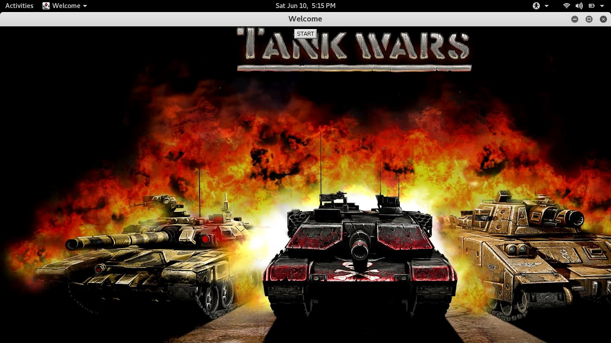

# Tank Wars

#### AUTHOR:

- [Chandramohan Jagtap](https://github.com/cmjagtap "Chandramohan's github profile")
- [Saurabh Borse](https://github.com/SaurabhBorse "Saurabh's Github profile")

#### DESCRIPTION:
This was a mini project given to us for the course, `Programming using java`
during the academic year 2013-2014 .

#### How to play :

- ##### How to compile :
	
	There is a batch file just double click on it (if your windows user).

- ##### How To Play Tank Wars:
	
	- At the starting the players have to enter their names.
	- Then hit the “SAVE” button and the game will be started and the players name are stored to database.
	- Each player has one tank and five shots to shoot the opponent’s tank.
	- To destroy the target the players have facility to change the cannon angle.
	- The angle can be set from 1 degree to 80 degrees using simple scroll bars.
	- Then the player  have to choose the velocity of weapon.
	- This velocity can be chosen from limit 1 to 58 using scroll bar.

- ##### Hardware Requirement :

	Processor            : Pentium  IV or Any Higher Version
	Hard Disk            : 20GB min.
	Ram                  : 512 Min.
	Monitor              : With minimum 1024 X 768 resolutions.
                 
- #####  Software requirement :

	Operating Sys        : Windows, MAC
	Database             : MS-Access
	Java Development Kit : Java JDK 1.6 or higher

